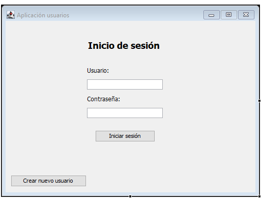
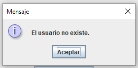
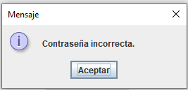
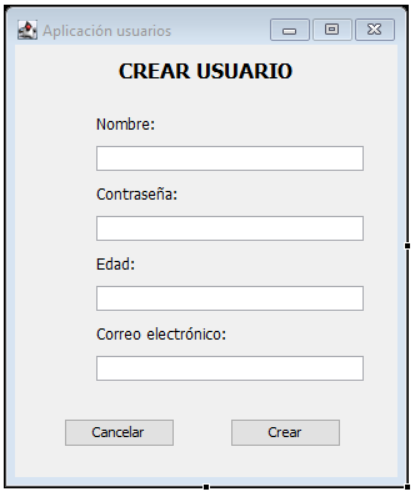
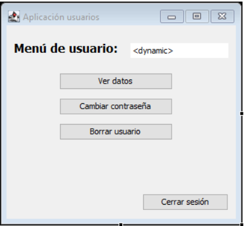
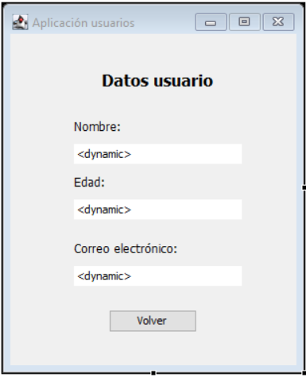
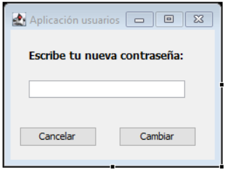
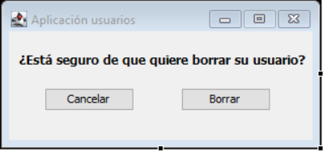

https://mp0486-add.vercel.app/docs/unidades/02/actividades/enunciado/pasos-previos

- [1. Aplicación para la gestión de usuarios con ficheros JSON](#1-aplicación-para-la-gestión-de-usuarios-con-ficheros-json)
  - [1.1. Introducción](#11-introducción)
  - [1.2. Pasos previos](#12-pasos-previos)
  - [1.3. Interfaces Gráficas](#13-interfaces-gráficas)
  - [1.4. Modelo de la aplicación](#14-modelo-de-la-aplicación)


# 1. Aplicación para la gestión de usuarios con ficheros JSON
## 1.1. Introducción
En este proyecto vamos a desarrollar una aplicación que permita registrar usuarios y acceder a su información. Toda la información relacionada con los usuarios se almacenará en un fichero JSON.

La aplicación permitirá realizar lo siguiente:

* Crear un nuevo usuario.
* Iniciar sesión a través de un formulario de login.
* Ver la información de mi usuario.
* Cambiar la contraseña de mi usuario.
* Borrar mi usuario.
  
En el proyecto se os proporciona un paquete gui que contiene las interfaces de la aplicación y un paquete model que contiene la lógica de la aplicación. Debéis realizar las modificaciones correspondientes sobre las clases de estos paquetes.

## 1.2. Pasos previos
> [!NOTE] 
> MATERIAL A DESCARGAR 
> Para descargar el proyecto podéis clicar en el siguiente enlace.

Primero debéis descargar el proyecto desde el enlace anterior e importarlo.

> [!IMPORTANT] 
> NOTA IMPORTANTE
> Una vez descargado el fichero del proyecto, es necesario renombrarlo antes de poder importarlo o descomprimirlo
> 
> Por ejemplo, si el fichero descargado se llama: proyecto-unidad1.tar-ea989dab2692d9ae69a8330c92b139c2.gz habrá que renombrarlo a: proyecto-unidad1.tar para poder descomprimirlo o importarlo.

Después, para trabajar con ficheros JSON desde Java vamos a usar el paquete org.json. Para poder usarlo, debemos descargarnos el archivo .jar correspondiente desde el repositorio de Maven: [Enlace Maven](https://mvnrepository.com/artifact/org.json/json) o bien desde el siguiente [enlace](https://search.maven.org/remotecontent?filepath=org/json/json/20230618/json-20230618.jar)

Una vez descargado, debemos añadirlo a nuestro Build Path. Para eso, haremos lo siguiente desde nuestro proyecto de Eclipse:

```
Click derecho > Build Path > Configure Build Path > Add External JARs 
```
Además, en el fichero **module-info.java** de nuestro proyecto tendremos que importar los paquetes **java.desktop** (para usar Swing) y **org.json**.

Con esto ya podemos empezar a trabajar.

## 1.3. Interfaces Gráficas
Las interfaces de la aplicación ya están creadas en el paquete gui. Deberéis hacer alguna modificación sobre ellas para capturar los eventos, pero nada más.

> [!IMPORTANT]
> CAPTURA DE EVENTOS
> Para capturar los eventos en cada interfaz, debéis **sobreescribir el método actionPerformed**. Dentro de este método tendréis que utilizar **e.getSource()** para capturar el evento de cada botón.

Las interfaces son las siguientes:

* **VentanaInicioSesion.java**:
  * En esta ventana el usuario puede iniciar sesión con su usuario y contraseña, si ya está registrado.
  * Si el usuario no existe, se mostrará un diálogo con el mensaje ``El usuario no existe``.
  * Si la contraseña no se introduce correctamente, se mostrará un diálogo con el mensaje ``La contraseña no es correcta``.
  
Una vez iniciemos sesión, pasaremos a la ventana del menú de usuario. En caso de no estar registrados, podremos crear un usuario en el botón ``Crear nuevo usuario``, que nos llevará a la ventana correspondiente.






* **VentanaCrearUsuario.java**:
  * En esta ventana podemos introducir los datos de un nuevo usuario.
  * Si pulsamos en Cancelar, volveremos a la ventana de inicio de sesión.
  * Si pulsamos en Crear, se almacenarán los datos en el archivo JSON y se volverá a la ventana de inicio de sesión.



- **VentanaMenuUsuario.java**:
  - En esta ventana el usuario podrá realizar acciones sobre su perfil.
  - En el campo blanco se debe mostrar el nombre del usuario que inició sesión.
  - Si pulsamos en ``Ver datos``, se abrirá la ventana de datos del usuario.
  - Si pulsamos en ``Cambiar contraseña``, se abrirá la ventana de cambio de contraseña.
  - Si pulsamos en ``Borrar usuario``, se abrirá la ventana de confirmación de borrado del usuario.
  - Si pulsamos en ``Cerrar sesión`` se volverá a la ventana de inicio.



- **VentanaVerUsuario.java**
  - Se mostrarán en los diferentes campos el nombre, edad y correo electrónico del usuario.
  - Al pulsar en ``Volver`` se cerrará la ventana y se volverá al menú del usuario



- **VentanaCambiarContraseña.java**:
  - En esta ventana se puede introducir la nueva contraseña del usuario.
  - Si pulsamos en ``Cambiar`` se realizará el cambio y se cerrará la sesión, volviendo a la ventana de inicio.
  - Si pulsamos en ``Cancelar`` se cerrará la ventana, volviendo al menú del usuario sin realizar el cambio.



- **VentanaBorrarUsuario.java**:
  - En esta ventana podremos confirmar el borrado del usuario.
  - Si se pulsa en ``Borrar``, se borrará el usuario y se cerrará la sesión, volviendo a la ventana de inicio.
  - Si se pulsa en ``Cancelar``, se cerrará la ventana y se volverá al menú del usuario.



## 1.4. Modelo de la aplicación
El formato del fichero JSON donde se almacena la información debería tener el siguiente formato:

```json
[
    {
		"nombre": "fernando",
		"contraseña": "password",
		"edad": "19",
		"correo": "fernando@correo.com"
	},
	{
		"nombre": "ana",
		"contraseña": "12345",
		"edad": "30",
		"correo": "ana@correo.com"
	}
]
```

Dentro de la carpeta del proyecto, en el paquete **model** se encontrarán las clases que gestionan la lógica de la aplicación.

La clase **AplicacionUsuarios** tendrá como atributos la ruta del fichero JSON y las diferentes ventanas de la aplicación. Además, deberá tener los siguientes métodos:

- ``private void crearFicheroJson():`` crea el fichero JSON si todavía no existe.
  
- ``private JSONArray obtenerUsuariosJson():`` devuelve un JSONArray que contiene a todos los usuarios registrados en la aplicación.
  
- ``private int obtenerPosicionUsuario(String nombreUsuario, JSONArray usuarios)``: devuelve la posición de un usuario dentro del array de usuarios. Si el usuario no está en el array, devuelve -1.
  
- ``private JSONObject obtenerUsuarioJson(String nombreUsuario)``: devuelve todos los datos de un usuario, en formato JSONObject. Si el usuario no existe, devuelve null.
  
- ``public void ejecutar()``: ejecuta la ventana de inicio de sesión.
  
- ``public void iniciarSesion(String nombreUsuario, String contraseñaUsuario)``: inicia sesión en base al usuario y contraseña introducidos.
  
- ``public void cerrarSesion()``: cierra la sesión y vuelve a la ventana de inicio.
  
- ``public void crearUsuario(String nombre, String contraseña, String edad, String correo)``: registra un usuario en el fichero JSON en función de los datos pasados por parámetro.
  
- ``public void cambiarContraseña(String nombre usuario, String nuevaContraseña)``: cambia la contraseña del usuario en el fichero JSON.
  
- ``public void borrarUsuario(String nombreUsuario)``: borrar el usuario del fichero JSON y cierra sesión.
  
- ``public void mostrarVentanaCrearUsuario()``: abre la ventana para crear un nuevo usuario.
  
- ``public void mostrarVentanaVerUsuario(String nombreUsuario)``: abre la ventana en la que se muestran los datos del usuario.
  
- ``public void mostrarVentanaCambiarContraseña(String nombreUsuario)``: abre la ventana que permite introducir una nueva contraseña.
  
- ``public void mostrarVentanaBorrarUsuario(String nombreUsuario)``: abre la ventana para confirmar el borrado del usuario.

La clase **Principal** tendrá un método ``main`` en el que simplemente se creará un objeto de la clase ``AplicaciónUsuarios`` y se llamará al método ``ejecutar()``

> [!NOTE]
> Notas especial

> [!TIP]
> Consejo

> [!IMPORTANT]
> Consejo

> [!WARNING]
> Consejo

> [!CAUTION]
> Consejo