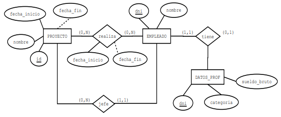

# Descripción del proyecto
En este proyecto vamos a desarrollar una aplicación que permita gestionar diversos proyectos de una empresa.

El diagrama conceptual de la base de datos es el siguiente:

Teniendo en cuenta que:

- Puede haber empleados que no estén en plantilla y que solo son contratados para proyectos determinados.
- Los datos profesionales de los empleados en plantilla se representan con la entidad ``DATOS_PROF``.
- Solo pueden ser jefes de proyecto los empleados en plantilla.

## Tareas a realizar
Se debe desarrollar una aplicación utilizando Hibernate que tenga las siguientes funcionalidades:

- Crear, borrar y modificar los datos de un empleado.
- Crear, borrar y modificar los datos de un proyecto.
- Asignar un empleado a un proyecto.
- Indicar el fin de la participación de un empleado en un proyecto.
- Cambiar el jefe de un proyecto.
- Mostrar los datos de un proyecto (nombre, fechas, empleados…).
- Mostrar los datos de los empleados que están en plantilla.
- Mostrar los empleados que son jefes de proyecto.